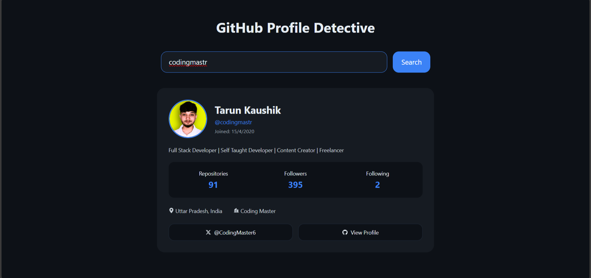

# 🔍 GitHub Profile Detective App

A responsive React application that allows users to search for GitHub profiles and view details in real-time using the GitHub API. Quickly see profile information, repositories, followers, and activity with a clean, modern UI.

---

## 🚀 Live Demo

🔗 [View Live Demo](https://githubprofile-detective.netlify.app/)

---

## ✨ Features

- 🔎 Search GitHub users by username  
- 👤 View profile information (avatar, name, bio, location)  
- 👥 Display followers and following count  
- 📦 List public repositories  
- ⚡ Real-time data fetching using GitHub REST API  
- 📱 Fully responsive design for desktop and mobile  
- 🖤 Dark theme inspired design  

---

## 🛠️ Tech Stack

- **Frontend:** HTML, CSS, JavaScript / React.js  
- **API:** GitHub REST API  
- **Styling:** CSS / Tailwind CSS  
- **Deployment:** Netlify / Vercel  

---

## 📸 Screenshot

---

## ⚙️ How It Works

1. Enter a GitHub username in the search bar  
2. The app fetches profile data using the GitHub REST API  
3. Displays profile info, stats, location, company, and links to Twitter/GitHub  

---
## ⚙️ How It Works

1. Type a GitHub username into the search bar.
2.The app fetches the user's profile and repository data from the GitHub API.  
3.Profile details, stats, and social links are displayed instantly with a clean UI.  

---

## 🚀 Roadmap

### ✅ Current Features
- Fully responsive design for all devices 
- Smooth animations for better user experience  
- Real-time fetching of GitHub user data
- Display of profile information, repositories, followers, and following

### 🔮 Upcoming Improvements
-Dark mode toggle 🌙 for comfortable viewing at night  
- Blog section 📝 to share development tips and tutorials 
- Additional social media integration 

---

## 📬 Contact

Feel free to reach out to me:
 
- [LinkedIn](https://www.linkedin.com/in/jay-avgune-1316b323a?utm_source=share&utm_campaign=share_via&utm_content=profile&utm_medium=android_app) 
- [Instagram](https://www.instagram.com/jay.avgune?igsh=ejF2YW44bXNrZ3Ry)

---

